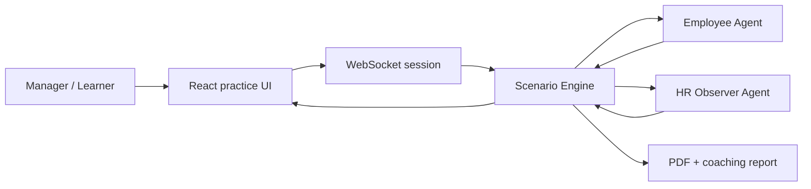

# Pathwise

AI-powered leadership conversation practice for managers and executive coaches.

Pathwise lets managers rehearse high-stakes conversations with realistic AI employees while a separate HR observer tracks legal risk, psychological safety, and clarity of feedback in real time. Coaches can use the generated session reports to turn practice data into targeted coaching.

Live demo: https://pathwise-ashy.vercel.app

## Why It Exists

Leadership coaching usually depends on memory, role-play, and periodic sessions. The moments that matter most often happen between coaching sessions: performance reviews, promotion denials, conflict de-escalation, terminations, and sensitive feedback.

Pathwise turns those moments into repeatable simulations:

- Practice before a real conversation, not after it goes badly
- See hidden employee reactions through a shadow channel
- Track HR risk and behavioral quality turn by turn
- Generate structured reports coaches can review asynchronously
- Upload policy or role context to make the simulation more company-specific

## Product Highlights

| Area | What is built |
| --- | --- |
| Multi-agent simulation | Employee agent responds emotionally and contextually; HR agent observes risk and feedback quality |
| Scenario engine | Scenario definitions include character bio, hidden goals, success criteria, and coaching frameworks |
| Real-time dashboard | Psychological safety, legal compliance, and clarity metrics update during the conversation |
| Shadow channel | Surfaces hidden employee thoughts and HR observations for coaching feedback |
| Coach workflow | Coach home, client scenario assignment, scenario configuration, analytics, and practice history views |
| Voice layer | Optional Gemini/Google Cloud voice paths for more immersive simulations |
| Reports | PDF report generation with top issues, behavioral analysis, and recommendations |
| Document context | Upload handbook/policy text to inject additional context into a session |

## How It Works



The backend keeps a `ScenarioEngine` per active WebSocket connection. Each manager message is processed by the employee and HR agents in parallel. The employee agent returns the visible response; the HR agent updates metrics and flags risk. At the end of the scenario, the engine turns the session into a coach-ready report.

## Tech Stack

| Layer | Technology |
| --- | --- |
| Frontend | React 18, TypeScript, Vite, Tailwind CSS |
| Backend | Node.js, Express, TypeScript, WebSocket |
| AI providers | Gemini primary, with adapter structure for Claude and Ollama |
| Voice | Google Cloud Text-to-Speech, Gemini live voice experiments |
| Reporting | PDFKit |
| Deployment | Vercel frontend, Render-compatible backend config |

## Repository Structure

```text
pathwise/
|-- src/
|   |-- agents/              # Employee + HR observer agents
|   |-- engine/              # Scenario state machine and scoring
|   |-- llm/                 # LLM provider adapters
|   |-- reports/             # PDF report generation
|   |-- audio/               # Voice/STT/TTS experiments
|   `-- server/              # Express + WebSocket API
|-- client/
|   |-- src/components/      # Learner and coach-facing UI
|   |-- src/hooks/           # WebSocket and voice hooks
|   `-- src/services/        # Voice service integrations
|-- TESTING.md
|-- VOICE_SETUP.md
`-- render.yaml
```

## Getting Started

### Prerequisites

- Node.js 18+
- Gemini API key for the default hosted AI path
- Optional: Google Cloud credentials for voice generation

### Backend

```bash
npm install
cp .env.example .env
npm run dev
```

The backend starts on `http://localhost:3000`.

### Frontend

```bash
cd client
npm install
cp .env.example .env
npm run dev
```

The frontend starts on `http://localhost:5173`.

### Useful Scripts

```bash
npm run build          # Type-check and compile backend
npm run dev            # Run backend in watch mode
npm run lint           # Lint backend source
cd client && npm run build
```

## Environment Variables

Backend:

```env
PORT=3000
LLM_PROVIDER=gemini
GEMINI_API_KEY=your_key_here
ALLOWED_ORIGINS=http://localhost:5173,https://pathwise-ashy.vercel.app
GOOGLE_APPLICATION_CREDENTIALS=/absolute/path/to/service-account.json
```

Frontend:

```env
VITE_API_URL=http://localhost:3000
VITE_WS_URL=ws://localhost:3000
VITE_GEMINI_API_KEY=your_key_here
```

## Current Scenarios

- Defensive performance review
- Promotion denial
- Layoff conversation
- Role conflict and prioritization
- Coaching-style feedback conversations

Scenario definitions are intentionally data-rich: they include organization context, character biographies, hidden goals, objectives, and success criteria. That makes the system easier to expand without rewriting the engine.

## Production Readiness Notes

This repo is a working MVP, not a compliance-certified coaching product. The next production milestones are:

- Persistent session storage instead of in-memory stores
- Authentication and coach/client permissions
- Automated evals for scenario quality and scoring consistency
- Stronger document parsing for uploaded PDFs
- Audit logging for enterprise coaching deployments

## Roadmap

- [x] Multi-agent simulation engine
- [x] Scenario library and learner flow
- [x] Coach-facing dashboard surfaces
- [x] PDF coaching reports
- [x] Document upload for contextual practice
- [x] Optional voice interaction experiments
- [ ] Authenticated coach/client workspaces
- [ ] Persistent session database
- [ ] Scenario quality eval suite
- [ ] Enterprise policy/RAG ingestion

## Built By

Saurabh Bains - product builder focused on AI workflows for high-context human decisions.
